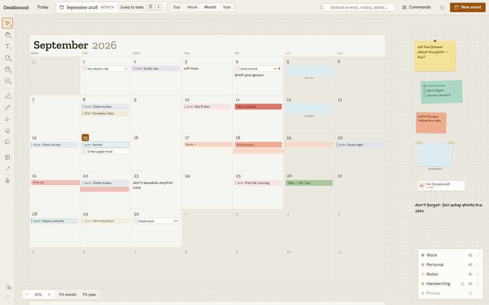
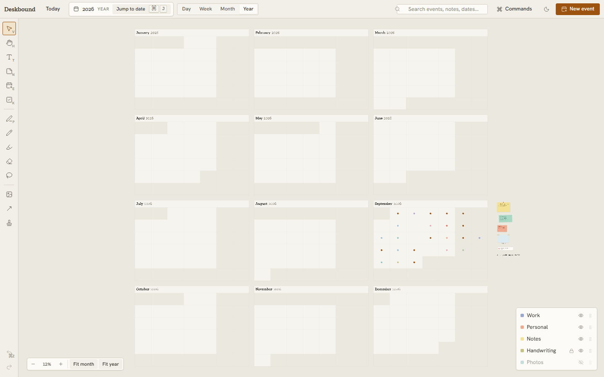
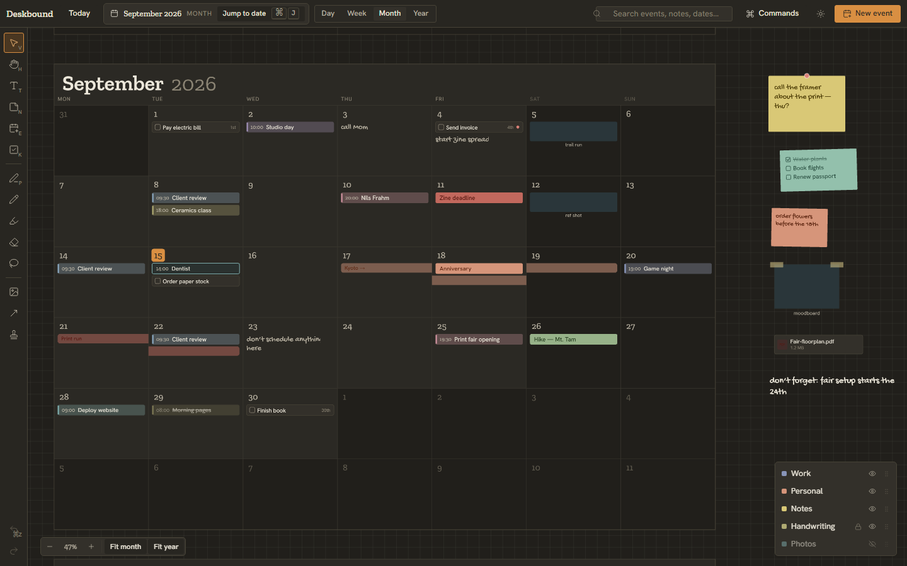

# Yearleaf — Infinite Desk Calendar 🍂

A desktop-first, **local-first spatial calendar** where time is an infinite canvas. Zoom out and the desk is an annual planner; move closer and it becomes a month, a week, and finally a day that behaves like a notebook page. Events share the paper with sticky notes, handwriting, images, tasks, and highlights.



No account. No cloud. Your desk lives on your machine.

## ✨ What works today

The workspace is **one continuous, GPU-rendered world** (PixiJS 8): every month of every
year has a fixed place on the desk, zooming changes the level of detail, and navigating
time is just panning. The [Deskbound design](docs/design/) supplies every color, type
role, and control.

- **Infinite spatial canvas** — pan (space-drag, wheel, or the Pan tool) and zoom
  (Ctrl/⌘ + wheel around the cursor) from a whole year down to a single day; the
  Day/Week/Month/Year control applies zoom presets onto the same world.
- **Progressive detail** — year tier shows month structure and density dots; month tier
  shows numerals, event chips, tasks, ranges, handwriting, and photos; week/day tiers
  add metadata lines.
- **Real month navigation** — any month of any year, with the date navigator following
  the viewport focus; Today, search, and palette jumps center and flash the target day.
- **A lived-in month** — events (timed, all-day, tentative, recurring, completed),
  tasks, multi-day ranges, handwriting, and taped photos on a September 2026 sample desk.
- **Desk objects** — sticky notes (with checklists), images, file attachments, and
  freeform text: drag to move, southeast handle to resize, arrow keys to nudge,
  Delete to remove, double-click to edit (DOM editor over the canvas), double-click
  empty paper to write.
- **Universal undo/redo** — every mutation is a command; a drag or resize commits
  exactly one history entry (⌘Z / ⇧⌘Z).
- **Selection & inspector** — hit-testing runs through a spatial index; the contextual
  inspector edits paper color, geometry, event schedule, and image captions.
- **Search & command palette** — search events, notes, handwriting, and files; ⌘K opens
  the palette.
- **Light & dark themes** — the PixiJS scene reads its palette from the Deskbound CSS
  tokens, so both themes stay single-sourced.

| Year tier (12%) | Dark theme |
| --- | --- |
|  |  |

## 🧭 Architecture

The full decision record lives in [`docs/Infinite-Desk-Calendar-Architecture-Decisions.md`](docs/Infinite-Desk-Calendar-Architecture-Decisions.md). The short version:

| Layer | Choice |
| --- | --- |
| Application UI | Angular 22 (signals, zoneless) |
| Spatial renderer | PixiJS 8 (`packages/canvas` — layered scene, month culling, spatial index; design record in [docs/design-canvas-renderer.md](docs/design-canvas-renderer.md)) |
| Desktop shell | Tauri 2 (upcoming) |
| Local data | SQLite + filesystem attachments (upcoming) |
| Design system | Deskbound (`packages/deskbound`) |
| Tests | Vitest + Playwright (later) |

### Workspace layout

```text
yearleaf/
├── apps/
│   └── desktop/            Angular application shell
├── packages/
│   ├── domain/             Entities, calendar math, command/undo architecture
│   ├── canvas/             Date↔world layout, viewport math, spatial index, PixiJS scene
│   ├── deskbound/          Design system: CSS tokens + Angular components
│   └── persistence/        Storage contracts + in-memory adapter
└── docs/
    ├── design/             Imported design reference (opens in a browser)
    └── *.md                Architecture record
```

Two rules keep the codebase honest: **Angular owns chrome, the canvas owns spatial content**, and **every persistent mutation is an undoable command** — pointer handlers never write state directly.

## 🚀 Getting started

Requires Node ≥ 20 and [pnpm](https://pnpm.io) (`corepack enable pnpm`).

```bash
pnpm install
pnpm dev            # serve the app at http://localhost:4200
pnpm build          # production build
pnpm test           # package tests (Vitest) + app tests
```

Try it: press `N` for a sticky note, drag it somewhere better, double-click it to
rewrite it, then Ctrl+Z your way back.

## 🗺️ Where this is going

See [ROADMAP.md](ROADMAP.md) — next up are the Tauri shell and SQLite persistence
(milestone 3), then editing depth: recurrence, handwriting, and attachment import.

## Contributing

Conventional commits, documented public APIs, no AI co-author trailers — the working agreements are in [CONTRIBUTING.md](CONTRIBUTING.md).
