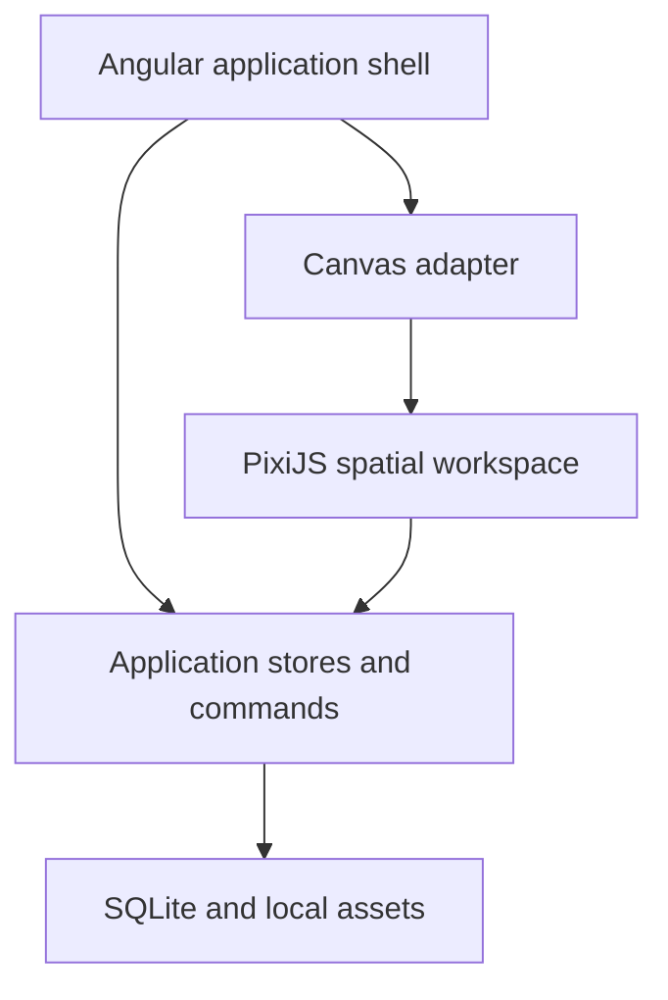
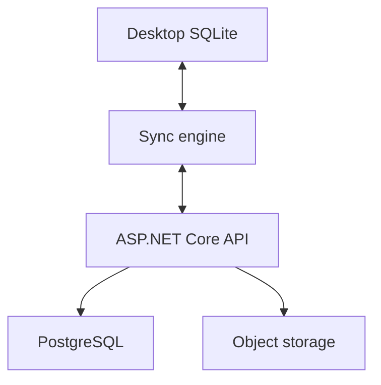

# Infinite Desk Calendar Architecture Decisions

**Status:** Accepted for initial implementation  
**Decision date:** September 15, 2026  
**Scope:** Version 1 desktop application and its path toward web, sync, and collaboration

## Decision Summary

Infinite Desk Calendar will begin as a desktop-first, local-first application built with Angular, PixiJS, Tauri, and SQLite. Angular will own the application interface, PixiJS will render the spatial calendar workspace, and Tauri will provide the native desktop shell and operating-system integration.

Version 1 will not require an account or a cloud service. User actions will operate against local state so that writing, drawing, zooming, and moving objects remain immediate. A cloud API, multi-device sync, and collaboration may be added after the local product and data model are stable.

## Product Context

Infinite Desk Calendar treats time as a spatial workspace. At a distant zoom level, the user sees an annual planner. Moving closer reveals a month, then a week, and finally a day that behaves like a notebook page. Events share the workspace with notes, handwriting, images, tasks, highlights, and connectors.

This makes the canvas the main technical problem. The application must support smooth zooming and panning, large numbers of freely positioned objects, direct manipulation, handwriting, attachments, and universal undo and redo. A conventional calendar made from a large tree of HTML elements would become difficult to render and manipulate at the required scale.

## Goals

- Keep canvas interaction smooth as the desk grows across months and years.
- Make the application useful without an account or network connection.
- Use web technologies for most product development while retaining native desktop capabilities.
- Preserve a future path to a web client, cloud sync, and shared calendars.
- Make the architecture understandable and maintainable by a small team or solo developer.
- Keep Version 1 focused on the spatial application rather than backend infrastructure.

## Technology Decisions

| Area | Decision | Responsibility |
| --- | --- | --- |
| Desktop shell | Tauri 2 | Windows, macOS, and Linux packaging; native dialogs; filesystem; clipboard; drag and drop; notifications; updates |
| Application UI | Angular 22 | Toolbars, inspectors, settings, search, command palette, menus, dialogs, and accessible DOM interaction |
| Primary language | TypeScript | Application, domain, state, and canvas interaction logic |
| Spatial renderer | PixiJS 8 | Calendar grid, canvas objects, layers, selection visuals, handwriting, and GPU-accelerated rendering |
| Native bridge | Rust through Tauri commands | Small, security-sensitive boundary for operating-system features and SQLite access |
| Local database | SQLite | Desks, calendars, events, spatial objects, tags, settings, and attachment metadata |
| Attachments | Local filesystem | Imported images, PDFs, documents, and other binary files |
| State management | Angular Signals | Reactive application state and derived UI state |
| Design system | Deskbound | CSS tokens and Angular components for the stationery-inspired interface |
| Unit and component tests | Vitest | Domain logic, stores, commands, and UI behavior |
| End-to-end tests | Playwright | Canvas and desktop workflows from the user's perspective |
| Workspace | pnpm workspace | Shared packages and applications in one repository |
| Continuous integration | GitHub Actions | Formatting, linting, tests, builds, and release checks |
| Cloud API later | ASP.NET Core | Accounts, sync, sharing, and server-side coordination when required |
| Cloud data later | PostgreSQL and S3-compatible storage | Synced structured data and attachment storage |
| Collaboration later | CRDT-based model such as Yjs | Concurrent shared editing after single-user sync is proven |

The listed framework versions are the initial implementation baseline recorded with this decision. Exact package versions should be validated when the repository is scaffolded and then pinned in the lockfile.

## Application Boundaries

Angular and PixiJS will have separate responsibilities.



### Angular owns the application

Angular will render interface elements that benefit from normal DOM behavior:

- top toolbar and tool rail
- contextual inspector
- layers and calendar management
- universal search
- command palette
- context menus and popovers
- settings and onboarding
- accessible forms and text editing surfaces

Angular should not render the complete calendar workspace as thousands of positioned `div` elements.

### PixiJS owns the workspace

PixiJS will render and interact with spatial content:

- year, month, week, and day calendar geometry
- events, tasks, sticky notes, and freeform text
- images and attachment previews
- handwriting, highlights, and drawings
- connectors, arrows, guides, and snapping indicators
- selections, resize handles, lasso regions, and hover states

The canvas package must expose domain-level operations rather than leaking PixiJS objects into the rest of the application. This keeps persistence, commands, and tests independent from the renderer.

## Hybrid Canvas and DOM Editing

Static text may be rendered in PixiJS, but active text editing will use a real DOM control positioned over the corresponding canvas coordinates.

When the user edits a text object:

1. The canvas converts the object's world coordinates into screen coordinates.
2. Angular places a `textarea` or another suitable editor over the object.
3. PixiJS temporarily hides or de-emphasizes the rendered text.
4. The user edits with native text selection, input method support, spellcheck, and keyboard behavior.
5. A command commits the updated text and removes the DOM overlay.
6. PixiJS renders the saved value again.

This approach avoids building a text editor inside WebGL and provides a stronger accessibility baseline.

## Desktop Shell

Tauri is preferred over Electron for the initial desktop application. It allows the product to use the operating system's web renderer rather than bundling a complete Chromium runtime. Tauri also supplies the native features that the application needs:

- file open and save dialogs
- controlled filesystem access
- desktop drag and drop
- clipboard integration
- notifications
- window management
- application updates
- platform packaging and signing

Rust should remain a narrow infrastructure layer. Product and domain behavior should stay in shared TypeScript packages unless an operation requires native access, stronger isolation, or measurable performance that cannot be achieved in the web layer.

## Local First Persistence

Version 1 will work without account creation and without a server. SQLite will be the authoritative local store for structured data. Write-ahead logging should be enabled where supported to improve local read and write behavior.

The application will save small, structured records in SQLite and store large binary attachments in an application-managed asset directory. SQLite records will reference attachments by relative path and stable identifier.

An example desk layout is:

```text
InfiniteDesk/
|-- infinite-desk.db
`-- assets/
    |-- 8eab2f4d.jpg
    |-- ab8130ce.pdf
    `-- 91ac2d12.png
```

Binary assets should not be stored as SQLite blobs by default. Keeping them in the filesystem simplifies import, export, backup, preview generation, and eventual object-storage sync.

## Initial Data Model

The data model should separate spatial placement from type-specific content. A shared `calendar_object` record supplies identity, date association, geometry, z-order, and lifecycle metadata. Typed records or validated JSON payloads provide the properties unique to events, notes, drawings, and other objects.

### Core entities

- `desk`
- `calendar`
- `calendar_object`
- `event`
- `recurrence_rule`
- `attachment`
- `drawing`
- `tag`
- `object_tag`
- `setting`

> **Delivery note (decided 2026-09-17, recorded here 2026-09-19).** These
> entities are the model's vocabulary, not a schema anyone owes up front:
> schema v1 grows **one migration per feature**, so each table is designed
> beside the flow that uses it (`apps/desktop/src-tauri/src/db.rs` is the
> authority on what exists). Shipped so far: `desk` and `calendar_object`
> (migration 1), `event` and `recurrence_rule` (migration 2, plus the `placed`
> flag in migration 3), and `attachment` (migration 4). `drawing` lands with
> handwriting, `tag`/`object_tag` with tagging, `setting` with preferences.
> `calendar` has been needed by nothing so far — no flow separates calendars
> within a desk — and should be treated as an open design question rather
> than a table with an owner.

### Calendar object fields

```text
calendar_object
----------------------------
id
desk_id
calendar_id
type
x
y
width
height
rotation
z_index
start_date
end_date
data_json
created_at
updated_at
```

Initial object types include:

- text
- sticky note
- event
- task
- image
- drawing
- connector
- highlight
- file

The schema must not assume that every object fits entirely inside one day cell. Objects may overlap, cross date boundaries, or remain attached to broader time ranges.

### Attachment fields

```text
attachment
----------------------------
id
calendar_object_id
original_filename
content_type
relative_path
size_bytes
sha256
created_at
```

Imported filenames must not be used as storage identifiers. The application should generate safe internal names while preserving the original filename as metadata.

## State Management

Angular Signals will manage client state. NgRx is not part of Version 1 because the application's state can be divided into focused stores without introducing a separate action and reducer framework.

Expected stores include:

- `DeskStore`
- `ViewportStore`
- `SelectionStore`
- `ToolStore`
- `CalendarStore`
- `ObjectStore`
- `HistoryStore`

Stores should expose narrow commands and computed state. Renderer-specific objects must not become the source of truth. The domain state and SQLite records remain independent from PixiJS display objects.

## Command and History Architecture

All meaningful user mutations will pass through a command system. Features should not update persistent object properties directly from arbitrary UI or renderer code.

Initial commands include:

- `AddObjectCommand`
- `MoveObjectCommand`
- `DeleteObjectCommand`
- `ResizeObjectCommand`
- `RotateObjectCommand`
- `UpdateTextCommand`
- `GroupObjectsCommand`
- `UngroupObjectsCommand`
- `ChangeStyleCommand`
- `ImportAttachmentCommand`

Each command must define execution and reversal behavior. Commands may be combined into transactions for multi-object actions. This architecture supplies universal undo and redo, makes behavior testable, and creates a future path to an optional visible edit history.

High-frequency pointer movement should not produce a database write for every frame. A drag can update transient renderer state while active and commit one command when the gesture finishes. Periodic recovery snapshots may be added separately.

## Canvas Architecture

The canvas package will organize display objects into explicit layers.

```text
CanvasScene
|-- CalendarLayer
|   |-- Year
|   |-- Month
|   |-- Week
|   `-- Day
|-- EventLayer
|-- NoteLayer
|-- DrawingLayer
|-- AttachmentLayer
|-- ConnectorLayer
`-- InteractionLayer
    |-- Selection
    |-- ResizeHandles
    |-- Lasso
    `-- Guides
```

The renderer must support viewport culling and a spatial index so that off-screen objects do not consume unnecessary rendering or hit-testing work. Zoom thresholds will control progressive detail. For example, a distant year view may show only month structure, major color ranges, and important markers, while a close day view reveals full text and attachment detail.

World coordinates and calendar dates require a single documented mapping. The conversion service must be deterministic and shared by rendering, hit testing, navigation, search jumps, printing, and export.

## Repository Structure

The repository will use a pnpm workspace with applications and reusable packages.

```text
infinite-desk/
|-- apps/
|   |-- desktop/
|   `-- web/
|-- packages/
|   |-- canvas/
|   |-- deskbound/
|   |-- domain/
|   |-- persistence/
|   `-- sync/
|-- src-tauri/
|-- package.json
`-- pnpm-workspace.yaml
```

The web application and sync package may begin as placeholders or be added later. Version 1 should not build unused cloud abstractions in anticipation of uncertain requirements.

### Package responsibilities

| Package | Responsibility |
| --- | --- |
| `@infinite-desk/domain` | Entities, value objects, validated object payloads, recurrence rules, and commands |
| `@infinite-desk/canvas` | PixiJS scene, viewport, interaction tools, spatial index, and rendering adapters |
| `@infinite-desk/deskbound` | Design tokens, Angular components, icons, menus, inspectors, and canvas controls |
| `@infinite-desk/persistence` | Persistence interfaces, migrations, SQLite adapter, and later IndexedDB adapter |
| `@infinite-desk/sync` | Deferred sync protocol, operation log, conflict handling, and transport adapters |

## Testing Strategy

Vitest will cover domain rules, coordinate conversions, commands, history behavior, stores, serializers, and persistence adapters. Playwright will cover the complete workflows where canvas input and desktop behavior must be exercised together.

Priority automated scenarios include:

- creating an object by double-clicking empty calendar space
- moving, resizing, and deleting one or many objects
- undoing and redoing every supported mutation
- editing text through the DOM overlay
- navigating between year, month, week, and day scales
- preserving the zoom focal point
- importing an image through drag and drop
- reopening a desk and restoring its saved state
- recovering from a failed or interrupted attachment import
- using all primary tools without a mouse

Canvas performance tests should use realistic, lived-in desks rather than nearly empty fixtures. Benchmarks should track frame time, hit-test latency, time to open a desk, and memory use at representative object counts.

## Cloud and Sync Path

Cloud infrastructure is deferred until the local application is useful and the persistence model has survived real use.

When multi-device sync is added, each installed application will continue to operate against its local database. Synchronization will run asynchronously rather than placing a network request in the critical path of each canvas gesture.



The likely server stack is ASP.NET Core, PostgreSQL, EF Core, S3-compatible object storage, OpenTelemetry, and AWS. The sync protocol should be designed from explicit product requirements such as account ownership, multiple devices, offline edits, attachment transfer, and conflict resolution.

Real-time shared editing will not be assumed to be the same feature as personal multi-device sync. A CRDT-based model such as Yjs will be evaluated only when simultaneous collaboration becomes a committed requirement.

## Web Client Path

The web client can reuse the Angular application shell, domain package, design system, and canvas package. It will need a browser-specific persistence adapter, likely IndexedDB, plus browser-compatible attachment handling.

Desktop-only capabilities must be accessed through interfaces rather than imported directly into shared packages. For example, the desktop application can provide `SQLitePersistence` and `TauriFileService`, while the web application can provide `IndexedDbPersistence` and `BrowserFileService`.

## Rejected or Deferred Alternatives

### HTML as the primary canvas renderer

A DOM-heavy calendar would provide strong native accessibility but would struggle with thousands of freely positioned objects, handwriting, overlapping layers, zoom transforms, and renderer-level culling. The selected hybrid approach keeps accessible application controls and text editing in the DOM while using PixiJS for the dense spatial scene.

### Direct use of the Canvas API

Building on the browser Canvas API alone would require the project to implement scene management, batching, masking, texture handling, hit testing, object hierarchy, and many rendering optimizations. PixiJS supplies this graphics infrastructure while leaving the product-specific interaction model under project control.

### Electron

Electron is mature and capable, but its bundled Chromium runtime is unnecessary for the initial application. Tauri provides the required native bridge with a smaller application footprint. Electron remains a fallback if cross-platform webview differences or missing Tauri capabilities become a material delivery risk.

### tldraw as the core canvas

tldraw provides an advanced infinite-canvas SDK, but it is centered on React and introduces a licensing dependency for production use. Infinite Desk Calendar also needs a time-based spatial model that is central to the product. Owning that domain-specific canvas keeps Angular as the primary UI framework and preserves control over the core interaction engine.

### NgRx

NgRx adds useful conventions for large event-driven Angular applications, but its ceremony is not justified for the initial single-user application. Angular Signals and focused stores provide sufficient reactive state management. This decision can be revisited if state transitions become difficult to trace or coordinate.

### Cloud services in Version 1

Authentication, a hosted API, PostgreSQL, Redis, queues, and cloud object storage would increase deployment and operational work before they improve the core experience. They remain outside Version 1.

## Version 1 Boundaries

Version 1 includes:

- one local user
- one or more local desks and calendars
- spatial year, month, week, and day navigation
- core canvas objects
- handwriting and highlights
- local attachments
- search over structured text and metadata
- universal undo and redo
- import and export suitable for backup
- an accessible keyboard-driven application shell

Version 1 excludes:

- required accounts or authentication
- cloud persistence
- multi-device synchronization
- real-time collaboration
- microservices
- Kubernetes
- Redis
- event buses
- GraphQL
- server-side rendering
- mobile applications

## Consequences

### Benefits

- Canvas performance and interaction receive most of the engineering attention.
- The application remains fast and useful offline.
- The selected stack matches existing TypeScript, Angular, and C# experience.
- Native desktop features are available without moving the entire product into Rust.
- Shared TypeScript packages preserve a practical route to a later web client.
- The command model makes undo, redo, tests, and future synchronization easier to reason about.

### Costs and risks

- PixiJS canvas objects do not inherit DOM accessibility, so accessible mirrors and keyboard operations must be designed explicitly.
- Operating-system webviews may behave differently across Windows, macOS, and Linux.
- A custom spatial engine requires substantial work on selection, snapping, transforms, culling, handwriting, and input handling.
- Local-first backup, migrations, and attachment integrity become product responsibilities.
- Adding sync later will require stable identifiers, conflict rules, schema evolution, and careful operation ordering.

### Mitigations

- Keep structured calendar information available through accessible DOM views and inspectors.
- Test all supported operating systems early rather than waiting for release packaging.
- Define renderer-independent domain interfaces and command tests before adding many tools.
- Ship automatic local backups, transactional imports, schema migrations, and attachment checksums.
- Reserve globally unique identifiers and reliable timestamps from the first schema version.
- Keep cloud and collaboration concepts out of the gesture path until their requirements are known.

## Implementation Guardrails

- The PixiJS scene is a projection of domain state, not the authoritative data store.
- Canvas gestures commit commands; they do not write directly to persistence from pointer handlers.
- Active gestures may use transient state, but the final operation must be atomic and undoable.
- All native capabilities pass through narrow, permission-scoped Tauri commands.
- Imported files are copied into an application-managed directory and referenced with relative paths.
- Database migrations are versioned and tested against representative existing desks.
- Search jumps preserve spatial context and animate toward the target unless reduced motion is enabled.
- Progressive detail rules are explicit and testable at defined zoom thresholds.
- Keyboard and screen-reader behavior is designed alongside each interaction tool.
- Performance is measured with dense desks containing drawings, images, and overlapping objects.

## Open Questions

These decisions do not block the initial repository, but they require explicit answers before their related features are implemented:

- ~~Which SQLite integration provides the best Tauri security and migration workflow?~~ — answered in [design-sqlite-persistence.md](design-sqlite-persistence.md): rusqlite + rusqlite_migration behind typed Tauri commands.
- ~~What world-coordinate scale and origin strategy prevent precision problems across many years?~~ — answered in [design-canvas-renderer.md](design-canvas-renderer.md): month-grid world layout on a 2020 epoch.
- ~~How should recurring events relate to freely moved or annotated occurrences?~~ — answered in [design-recurrence.md](design-recurrence.md): occurrences are computed and materialise into real objects only when touched; position is derived from the date until moved.
- Which drawing representation balances visual quality, editability, and database size?
- What subset of content must have an accessible structured mirror?
- What export format can restore a complete desk, including attachments and application version metadata?
- When should edits be flushed to SQLite, and what recovery behavior is required after a crash?
- Which operating systems and input devices are supported at the first public release?
- What objective performance budgets define an acceptable dense desk?

## Initial Delivery Order

1. Scaffold the pnpm workspace, Angular desktop application, Tauri shell, and Deskbound token package.
2. Implement deterministic date-to-world-coordinate mapping and viewport navigation.
3. Render the calendar grid in PixiJS with year, month, week, and day detail thresholds.
4. Add selection, movement, resizing, keyboard navigation, and the command history system.
5. Add SQLite persistence and reopen the last desk on launch.
6. Add text, sticky note, event, and task objects with DOM-based editing.
7. Add handwriting, highlights, images, and managed attachment storage.
8. Add universal search, command palette, export, backup, and recovery behavior.
9. Complete accessibility, cross-platform, performance, and packaging work for the first release.

## References

- [Angular release schedule](https://angular.dev/reference/releases)
- [PixiJS versions](https://pixijs.com/versions)
- [Tauri documentation](https://v2.tauri.app/)
- [Tauri filesystem plugin](https://v2.tauri.app/plugin/file-system/)
- [Tauri updater plugin](https://v2.tauri.app/plugin/updater/)
- [SQLite write-ahead logging](https://sqlite.org/wal.html)
- [tldraw licensing](https://tldraw.dev/community/license)
